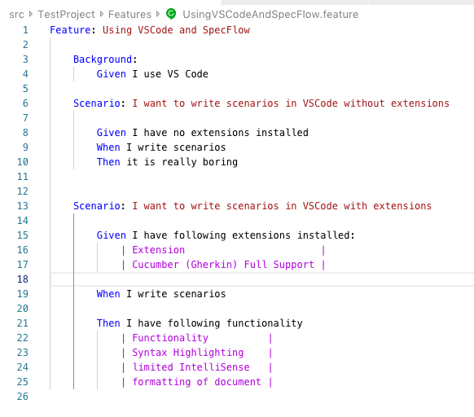
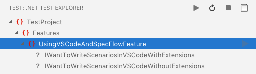
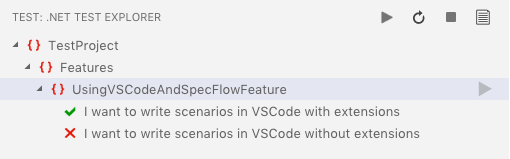
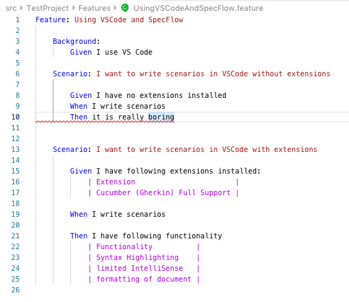

# How to use VSCode to work with SpecFlow

Using VSCode to write your SpecFlow scenarios is easy, as long as you install the right extension and have set up your project correctly.

## Project Setup

You have to use MSBuild to generate the code-behind files of your feature files. See [here](https://specflow.org/2019/generating-code-behind-files-using-msbuild) for more information on how to do this.

If you do not do this, you will not have any tests to execute.

## Installing and Configuring the VSCode Extension

### Writing Feature Files

We found a really good extension from Alex Krechik, which provides a lot of nice features for writing feature files.  
It is called `Cucumber (Gherkin) Full Support Extension for VSCode` and can be found [here](https://marketplace.visualstudio.com/items?itemName=alexkrechik.cucumberautocomplete).

The extension provides the following features for .NET projects:

- Syntax highlighting
- Formatting of the whole feature file
- Limited IntelliSense/AutoComplete

Unfortunately, we were unable to get the AutoComplete from steps already defined in the C# code to work. If you know how to do it, please let us know!

After installing the extension, you can configure it in the `settings.json` file. This is mostly needed for the IntelliSense/AutoComplete information (which doesn't work with C#), so you could skip this step.  
If you want to change the configuration, you can find the steps required to do so here: <https://github.com/alexkrechik/VSCucumberAutoComplete#how-to-use>

Once you are done, you will get nice colorful feature files in VSCode:

### Executing Scenarios

If you are used to the Test Explorer in Visual Studio, and don't like to execute tests via the command line, you can use Jun Han's `.NET Core Test Explorer` extension that adds this feature to VSCode. You can find the extension [here](https://marketplace.visualstudio.com/items?itemName=formulahendry.dotnet-test-explorer).

After setting the `dotnet-test-explorer.testProjectPath` path in your `settings.json` to the path of your solution, you can start to use it.
For this example project, the test explorer looks like this:

**Before executing the scenarios:**

**After executing the scenarios:**

And this is how it looks in a feature file:

While the scenario title is not marked as failing, you have the red lines at the last step of the failing scenario.

## Conclusion

While there is no dedicated SpecFlow extension for VSCode, there are already other extensions available that help you to use VSCode to write feature files and execute scenarios.
